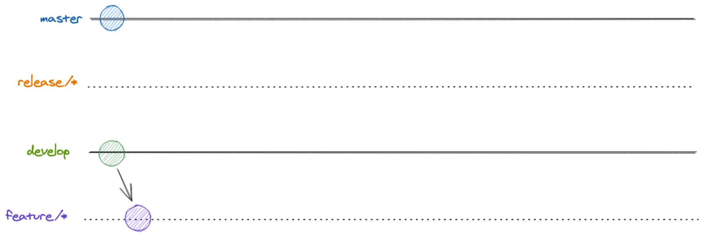

# Gitflow

As there are many different projects at JS+, the teams use different gitflows that best suit each project!

This repo contains some flows that are used by teams such as backend developers, frontend developers, etc.!

## Gitflow

Here we have all the documented gitflows so far:

- [Backend](gitflow/backend/README.md)
