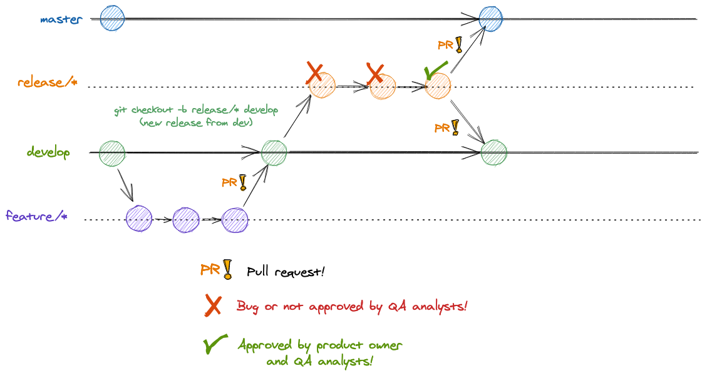
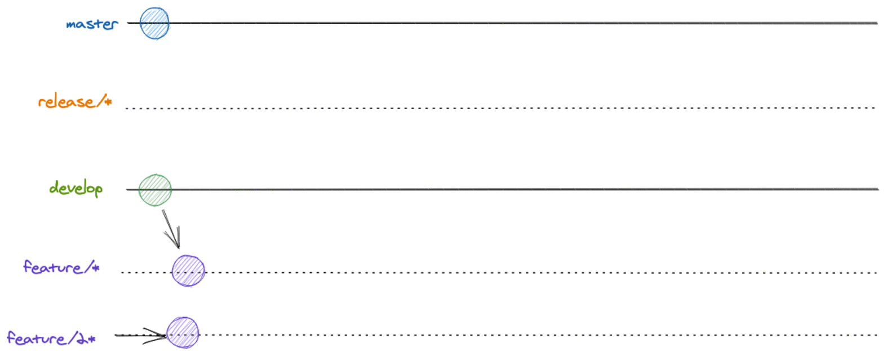
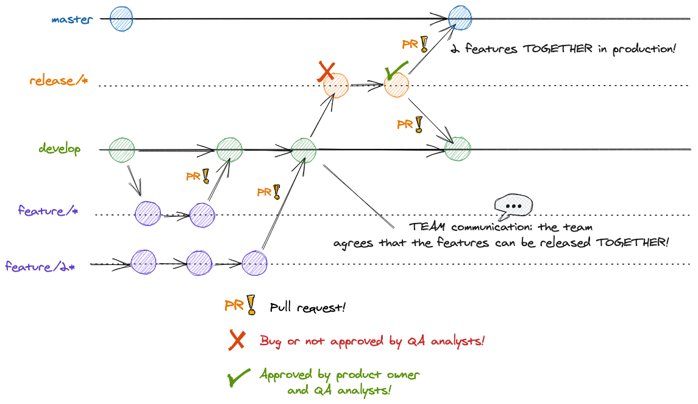
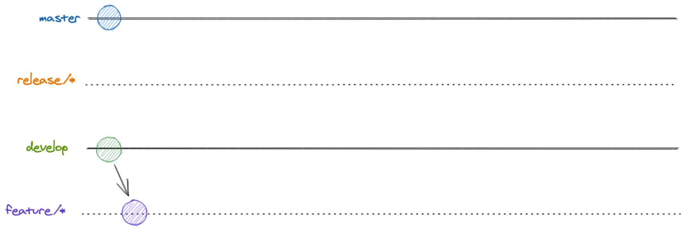
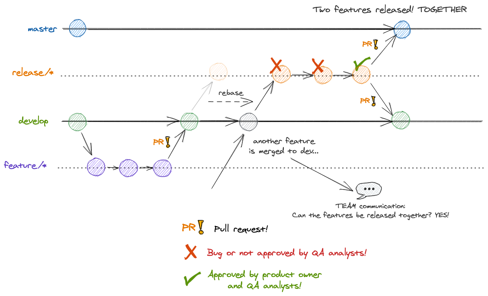
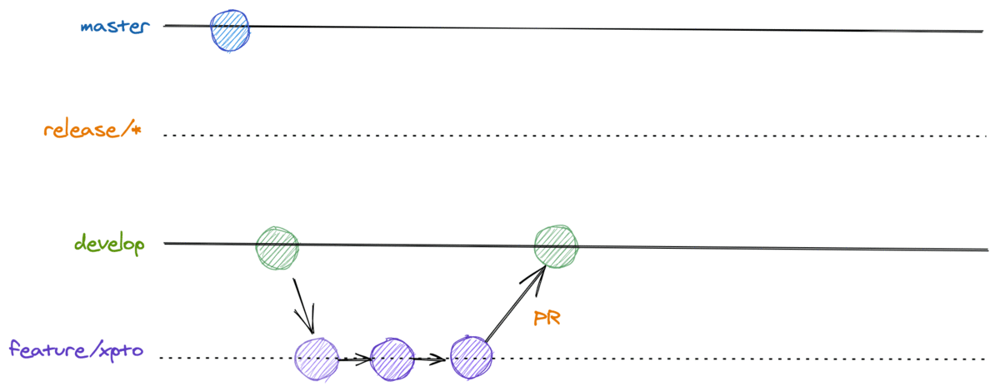
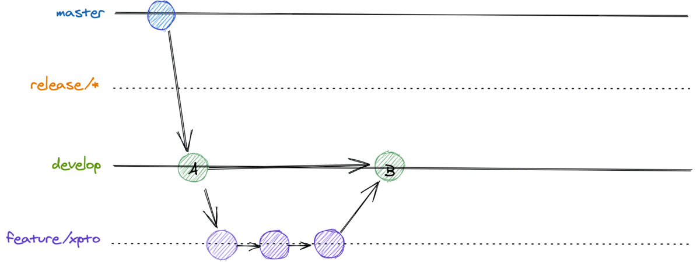

# Gitflow: Backend

The main gitflow is very easy to follow, but includes some variations that might happen on our day-to-day work and are also explained here.

**Content**

<!-- TOC depthFrom:1 depthTo:6 withLinks:1 updateOnSave:1 orderedList:0 -->

- [Main gitflow](#main-gitflow)
  - [Summary](#main-gitflow-tldr)
- [Variation: flow with commits on the release branch](#variation-flow-with-commits-on-the-release-branch)
- [Variation: flow with two features on dev without releases](#variation-flow-with-two-features-on-dev-without-releases)

  - [If the two features CANNOT go together to production](#if-the-two-features-cannot-go-together-to-production-without-releases)
  - [If the two features CAN go together to production](#If-the-two-features-CAN-go-together-to-production-without-releases)

- [Variation: flow with two features on dev with release reuse](#variation-flow-with-two-features-on-dev-with-release-reuse)

  - [If the two features CANNOT go together to production](#If-the-two-features-CANNOT-go-together-to-production)
  - [If the two features CAN go together to production](#if-the-two-features-can-go-together-to-production)

- [Variation: hotfix](#variation-hotfix)
- [Variation: broken dev](#variation-broken-dev)
  - [Fix it](#fix-it)
  - [Remove changes](#remove-changes)

<!-- /TOC -->

---

## Main gitflow


The main flow is easy to follow and the one we should strive to achieve. But, first things first, you should pair your local `develop` branch with what is on remote.

```sh
git checkout develop
git pull
```

Then, it's time to create your feature branch:

```sh
git checkout -b feature/xpto # or git branch feature/xpto && git checkout feature/xpto
```

If your local development workspace doesn't have the `feature/xpto` branch, the command above will create it and switch your workspace to the newly created branch!

Now, it's time to code! After you made your changes and think you have enough code to constitute a commit (a package with changes), create it with:

```sh
git add changed-file # if you want to add all changes made to all files into one commit: git add .
git commit -m "nice commit message" -m "More description" \
           -m "How many paragraphs can I stack?" -m "I don't know" # or `git commit` to bring your git editor (usually `vim`)
```

Then, when you feel confortable, just push your changes to remote!

```sh
git push -u origin feature/xpto
```

This will push any commit you did on your feature branch to remote and set the remote branch as a source reference to your local branch, so that any `git pull` and `git push` you do later, when working in this branch, is done referencing the remote one.

Many `git add`, `git commit` and `git push` later, it's time to bring your new feature to the remote `develop` branch and update the development environment with your changes. But, before that, we want to evaluate what you did, checking if the changes address what the task asked, if there are enough tests, if the code can introduce any obscure bug, etc. And, for this, we run through a process called **Code Review**. It's an important step to prevent any undesirable change and to leverage the knowledge across the team.

So, now, you need to create a merge request or a Pull Request (PR)! For that, use whatever tool you want! You could use the GitHub UI ([step guide](https://docs.github.com/en/free-pro-team@latest/github/collaborating-with-issues-and-pull-requests/creating-a-pull-request)) or the GitHub CLI tool ([manual](https://cli.github.com/manual/gh_pr)). After its creation, call for another DEV to review your changes. After some discussion and possible changes and only after you both agree that the feature can go on, merge your branch to `develop`!

With everything smooth on our development environment, you can delete your feature branch and create a new release branch!

```sh
git push -d origin feature/xpto # delete the feature branch from origin (remote)
git checkout develop && git pull
git checkout -b release/xpto
git push -u origin release/xpto
```

Now, with the QA, or homolog, environment updated, call for a QA analyst to test your brand new feature! After her approval and with the product owner (PO) consent, create a PR targeting the main production branch (usually `master`) and call for another DEV approval.

When it's approved, merge the PR and you're almost done! Take a time to monitor how your change affected the production environment and create a changelog to communicate everyone!

And, now we're done! Congrats!!!! :tada: :tada: :tada:

<a name="main-gitflow-tldr"></a>

### Summary

1. `git checkout develop && git pull`
2. `git checkout -b feature/xpto && git push -u origin feature/xpto`
3. Repeat `git add && git commit`, eventually `git push`, until the feature is done
4. Create a Pull Request (PR) targeting the `develop` branch and call for any DEV to review it
5. Do the requested changes, if necessary, until approval
6. Merge into `develop` and delete your feature branch
7. `git checkout develop && git pull && git checkout -b release/xpto && git push -u origin release/xpto`
8. QA Test
9. After QA and PO approval, create a PR targeting the `master`, or `main`, branch
10. After the PR approval, merge it and you're almost done!
11. Now, it's time to keep an eye if everything is fine with your feature in production and to create a changelog so everyone knows what you did!

## Variation: flow with commits on the release branch

A very common situation that may arise once a new release branch is created is something that definitely has happened to every developer out there (unless, well, he wasn't a human at all): a bug.

Even when the code seems to be working fine and all the tests are passing, things can still go wrong and hopefully you will have a QA analyst to help you identify the issue before the code actually reaches production.

In these situations, the gitflow allows developers to make commits **directly to the release branch** in order to fix the release but comes at the cost of creating bugfix code outside the develop branch. This is bad as it drives the `develop` branch farther from the code that is actually going to production and this violates one of the golden rules of this gitflow: to keep `develop` and `master` as close as possible as **every new released feature will come from the development branch**. Hence, if commiting to the `release/*` branch is a must, then do it but **do not ever forget** to create two PRs when the `release/*` has been validated:

- One PR to `master` (the actual code going to production)
- One PR back to `develop` (yes, this is required to keep master, dev and future releases with the required bugfix code)

So, here's the flow for this scenario:


And a final static image to illustrate the whole flow:



## Variation: flow with two features on dev without releases

This variation can be very common and depends a lot on how many developers are working with the same code base. This case usually happens when two or more developers finish writing their code on their respective feature branches, for example: `feature/feat-A` and `feature/feat-B`, and they both send their finished code to the `develop` branch. In this case, the `develop` branch will have **more than one new feature** at the same time.

When this happens, **team communication becomes essential**: the **team** must decide if the two features can be shipped together to production or not.

`PS`: Notice that, in this case, NO release branch has been created for any of the features. If a release branch already exists, then skip to the next variation: `Variation: flow with release reuse`.

Let's discuss the two possible outcomes of the team's decision:

### IF the two features CANNOT go together to production

If the team agrees that the two features cannot go together to production, and the two features are already on the `develop` branch, then `feature/feat-B` must be removed from the `develop` branch so that `feature/feat-A` can be used to create its `release/feat-A`.

Once `feature/feat-A` has been shipped to production, then `feature/feat-B` can be used to create a new release branch.

`PS`: Bear in mind that this scenario can create **bottlenecks** as one feature will have to wait on the other one before being tested and release to production.

### IF the two features CAN go together to production

If the team has agreed to release the two features together, then the flow is very straight forward: as the two features are already on the `develop` branch, just create a new release branch that will contain the two features that will be shipped to production: `release/feat-A-and-B` and proceed as usual with this release branch.



And a final static image to illustrate the whole flow:



## Variation: flow with two features on dev with release reuse

This variation can also be very common when the same code base is used by many developers. Here, one developer finishes writing his new feature, `feature/feat-A`, sends his code to `develop` and creates a release branch for his feature: `release/feat-A`.

After this, another develop also finishes writing his new feature: `feature/feat-B` and sends it to `develop`. Now, this second developer **cannot** open another release right away as `release/feat-A` already exists and might be being used by the QA analysts. Two release branches can create a lot of confusion and must be avoided.

Once again, **team communication becomes essential**: the **team** must decide if the two features can be shipped together to production or not.

### IF the two features CANNOT go together to production

If the team agrees that the features cannot go together to production, then `feature/feat-B` that is on the `develop` branch will have to wait until the other feature, `feature/feat-A`, is fully shipped to production. After that happens, and `release/feat-A` no longer exists, then a new release branch, `release/feat-B`, can be created and submitted for QA analysts and PO approval.

Remeber that this scenario can also create **bottlenecks** as `feature/feat-B` will have to keep waiting on `develop` until `feature/feat-A` is fully released to production and `release/feat-A` no longer exists.

### IF the two features CAN go together to production

If the team has agreed to release the two features together, then the **release branch that already exists can reused** to contain the two features (`feature/feat-A` and `feature/feat-B`) together.

The most common way to do this by rebasing the `release/feat-A` branch onto the top of the `develop` branch that already contains the new feature `feat-B`:

```bash
git checkout release/feat-A
git pull --rebase origin develop  # git pull with rebase instead of merging ~ git rebase develop
```

By rebasing the `release/feat-A` branch, this release branch will now contain the two features together (`feature/feat-A` and `feature/feat-B`). After this is done, then proceed as usual with this release branch that contains the two features that will be shipped together to production.



And a final static image to illustrate the whole flow:



## Variation: hotfix


Although this flow should usually be avoided, it might happen. So, when a wild serious bug appears in production and you need to fix it as soon as possible, it's time to create a hotfix!

The first step is to create your hotfix branch from the main branch. Supposing it's `master`, do the following:

```sh
git checkout master && git pull # remember to always be updated!
git checkout -b hotfix/bug
```

After fixing the bug and adding some tests for it, it's time to create the PR targeting `master`. Then, after the changes integrate on production and you guarantee that it fixes the bug, you **must** create a PR for `develop` so that the fix is also integrated there.

Finally, don't forget to release the fix to the QA environment (creating a `release/*` branch from `develop`). Although it can be done later, it's always important to have all environments stable and up to date!

## Variation: broken dev

It's important to say that we should not break our development environment at all costs. It's shared between all devs and we need to ensure that it's stable enough so that everyone can work with and use it for their tasks. Saying that, we know that it can happen. We can break DEV, we can release into it a half-baked feature. And, it's totally fine, because:

> To err is human

Consider it a lesson to learn and if that happen, we have two alternatives: fix it or remove the changes from `develop`.

### Fix it



If possible, we should always try to fix `develop` before any other change, because the flow is simpler. As any other feature, we start a new branch from `develop` (or merge the `develop` changes into your broken feature branch) and follow the normal development flow!

### Remove changes



But, if we know that the fix will take some time, it's important to revert the introduced changes. For that we have two alternatives:

- Reset the git codeline, as if the feature wasn't introduced to branch `develop`

Suppose that you're at the top (`HEAD`) of your branch and the commit sitting there is a merge commit that came from your PR. If you want to remove it:

```sh
git reset --soft HEAD^ # use `--hard` instead of `--soft` if you don't want the changes
git push --force # be very careful!
```

This will remove the commits associated with the last merged PR and rewrite the git codeline.

Notice here that we used `git push --force`. It's not something we should do with frequency because it affects everyone that is sharing the same repository and if someone just did a pull with your changes before the forced push, rewriting the timeline will just blew up her local repository. Thus, it's preferable to avoid it. That leads to our second approach:

- Revert the commits, creating a commit that revert them

Again, suppose that you're at the `HEAD` of your branch and the merge commit is the one sitting there. Then:

```sh
git revert -m 1 HEAD # or the SHA commit you want to revert
```

The command above will create the commit you want, effectively reverting all the changes introduced with the merged PR. We can also do it using the GitHub UI ([step guide](https://docs.github.com/en/free-pro-team@latest/github/collaborating-with-issues-and-pull-requests/reverting-a-pull-request)) and it's quite easy!

The thing we should be aware is that if we want our changes back we need to revert the revert. So, again, do a revert:

```sh
git revert HEAD # or the SHA commit
```

And continue your work!
