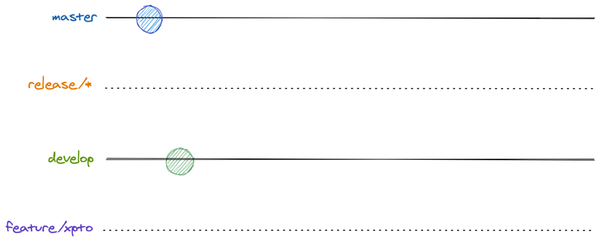
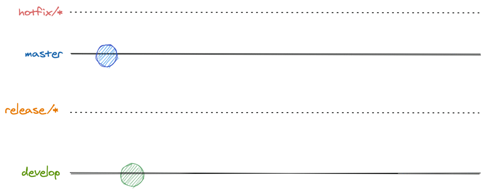

# Gitflow: Backend

The main gitflow is very easy to follow, but includes some variations that might happen on our day-to-day work and are also explained here.

**Content**

<!-- TOC depthFrom:1 depthTo:6 withLinks:1 updateOnSave:1 orderedList:0 -->

- [Main gitflow](#main-gitflow)
    - [Summary](#main-gitflow-tldr)
- [Variation: flow with extra sync (dev -> release -> prd)](#variation-flow-with-extra-sync-dev---release---prd)
- [Variation: flow with release reuse](#variation-flow-with-release-reuse)
- [Variation: flow with two features on dev](#variation-flow-with-two-features-on-dev)
- [Variation: hotfix](#variation-hotfix)
- [Variation: broken dev](#variation-broken-dev)

<!-- /TOC -->

---

## Main gitflow



The main flow is easy to follow and the one we should strive to achieve. But, first things first, you should pair your local `develop` branch with what is on remote.

```sh
git checkout develop
git pull
```

Then, it's time to create your feature branch:

```sh
git checkout -b feature/xpto # or git branch feature/xpto && git checkout feature/xpto
```

If your local development workspace doesn't have the `feature/xpto` branch, the command above will create it and switch your workspace to the newly created branch!

Now, it's time to code! After you made your changes and think you have enough code to constitute a commit (a package with changes), create it with:

```sh
git add changed-file # if you want to add all changes made to all files into one commit: git add .
git commit -m "nice commit message" -m "More description" \
           -m "How many paragraphs can I stack?" -m "I don't know" # or `git commit` to bring your git editor (usually `vim`)
```

Then, when you feel confortable, just push your changes to remote!

```sh
git push -u origin feature/xpto
```

This will push any commit you did on your feature branch to remote and set the remote branch as a reference to your local branch, so that any `git pull` and `git push` you do later, when working in this branch, is done referencing the remote one.

Many `git add`, `git commit` and `git push` later, it's time to bring your new feature to the remote `develop` branch and update the development environment with your changes. But, before that, we want to evaluate what you did, checking if the changes address what the task asked, if there are enough tests, if the code can introduce any obscure bug, etc. And, for this, we run through a process called **Code Review**. It's an important step to prevent any undesirable change and to leverage the knowledge across the team.

So, now, you need to create a merge request or a Pull Request (PR)! For that, use whatever tool you want! You could use the GitHub UI ([step guide](https://docs.github.com/en/free-pro-team@latest/github/collaborating-with-issues-and-pull-requests/creating-a-pull-request)) or the GitHub CLI tool ([manual](https://cli.github.com/manual/gh_pr)). After its creation, call for another DEV to review your changes. After some discussion and possible changes and only after you both agree that the feature can go on, merge your branch to `develop`!

With everything smooth on our development environment, you can delete your feature branch and create a new release branch!

```sh
git push -d origin feature/xpto # delete the feature branch from origin (remote)
git checkout develop && git pull
git checkout -b release/xpto
git push -u origin release/xpto
```

Now, with the QA, or homolog, environment updated, call for a QA colleague to test your brand new feature! After her approval and with the PO consent, create a PR targeting the main production branch (usually `master`) and call for another DEV approval.

When it's approved, merge the PR and you're almost done! Take a time to monitor how your change affected the production environment and create a changelog to communicate everyone!

And, now we're done! Congrats!!!! :tada: :tada: :tada:

<a name="main-gitflow-tldr"></a>
### TL;DR

1. `git checkout develop && git pull`
2. `git checkout -b feature/xpto && git push -u origin feature/xpto`
3. Repeat `git add && git commit`, eventually `git push`, until the feature is done
5. Create a Pull Request (PR) targeting the `develop` branch and call for any DEV to review it
6. Do the requested changes, if necessary, until approval
7. Merge into `develop` and delete your feature branch
8. `git checkout develop && git pull && git checkout -b release/xpto && git push -u origin release/xpto`
9. QA Test
10. After QA and PO approval, create a PR targeting the `master`, or `main`, branch
11. After the PR approval, merge it and you're almost done!
12. Now, it's time to keep an eye if everything is fine with your feature in production and to create a changelog so everyone knows what you did!

## Variation: flow with extra sync (dev -> release -> prd)

## Variation: flow with release reuse

## Variation: flow with two features on dev

## Variation: hotfix



Although this flow should usually be avoided, business needs is what should drive the development. So, when a wild serious bug appears in production and you need to fix it as soon as possible, it's time to create a hotfix!

The first step is to create your hotfix branch from the main branch. Supposing it's `master`, do the following:

```sh
git checkout master && git pull # remember to always be updated!
git checkout -b hotfix/bug
```

After fixing the bug and adding some tests for it, it's time to create the PR targeting `master`. Then, after the changes integrate on production and you guarantee that it fixes the bug, you **must** create a PR for `develop` so that the fix is also integrated there.

Also, don't forget to release the fix to the QA environment (creating a `release/*` branch from `develop`). Although it can be done later, it's always important to have all environments stable!

## Variation: broken dev
